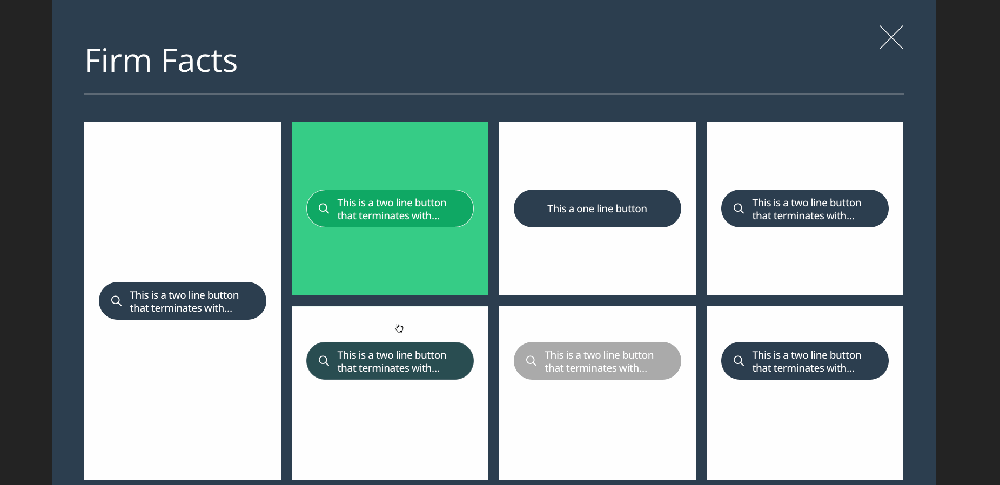

# Styling challenge

Styling challenge using scss modules and react

## Get started

To run it locally you need to install the packages and execute any of the commands
`pnpm dev` - `yarn dev` - `npm run dev` or whichever you use .

## Demo

